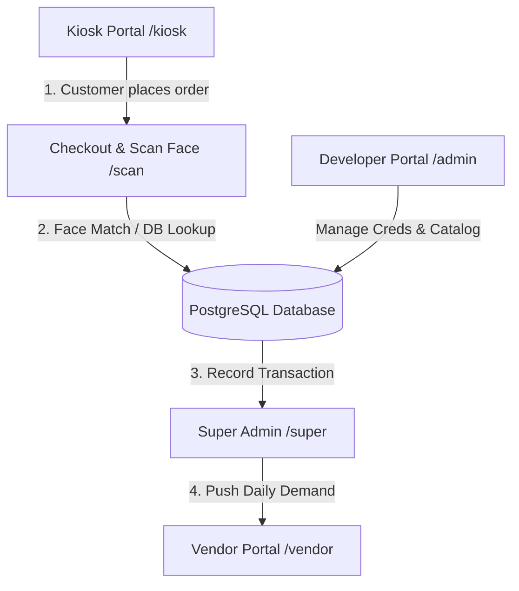

# Dinshaw's Kiosk Application: Comprehensive QA & Testing Guide

This guide is designed for QA testers to verify the features, flows, and data transitions of the Dinshaw's Self-Service Kiosk system.

* **Live Deployment Link**: [https://dinshaws.onrender.com](https://dinshaws.onrender.com)
* **Local Development Link**: [http://localhost:3000](http://localhost:3000)

---

## 1. 🔑 Portal Roles & Default Credentials

The application features a **unified login portal** at `/login`. Logging in with a specific role's credentials automatically routes the user to their respective dashboard.

| Portal Role | Target Route | Default Username | Default Password | Purpose |
| :--- | :--- | :--- | :--- | :--- |
| **Catalog Developer** | `/admin` | `admin` | `dinshaws` | Modifies products, categories, sections, and updates database credentials. |
| **Kiosk Super Admin** | `/super` | `superadmin` | `super123` | Views transactions, registers employee faces, and pushes supply demands. |
| **Vendor Portal** | `/vendor` | `vendor` | `vendor123` | Accesses pushed daily requirements and downloads CSV orders. |

---

## 🏗️ Core Application Architecture & Data Flow

---

## 3. 🧪 Step-by-Step Test Suites

### Test Suite A: Self-Service Kiosk & Session Timeout (`/kiosk`)
**Goal**: Verify product ordering and session inactivity safeguards.

1. **Access the Kiosk**: Navigate to `/` or `/kiosk`. You should see the **Touch to Start** welcome screen.
2. **Browse Products**: Click to enter. Browse products using category tabs (Milk, Dahi, Paneer).
3. **Add to Cart**: Click **Add to Cart** on multiple items. Verify the cart badge count increments.
4. **Session Timeout Test (Inactivity)**:
   * Leave the screen untouched on the catalog page.
   * **Expected Behavior**: A countdown timer (starts at 15 seconds) will appear in the top-right corner.
   * **Verification**: Wiggle the mouse or tap the screen during the countdown. The timer should disappear and reset.
   * **Verification**: Let the countdown reach `0`. The cart must be cleared, and you should be redirected to `/timeout`.
5. **Session Timeout Immunity**:
   * Open the **Cart Page** (slide-out cart or full cart page).
   * **Expected Behavior**: No countdown timer should ever appear. The session will remain active indefinitely on the cart page.

---

### Test Suite B: Face Enrollment & Scan Checkout (`/scan`)
**Goal**: Verify new user registration and checkout validation.

1. **Register a New User**:
   * Go to Kiosk ➔ Add items to Cart ➔ Click **Checkout**.
   * You will be redirected to `/scan`. The camera feed will initialize.
   * If your face is not recognized, click **Register/Enroll Face**.
   * Enter a test name (e.g., `Tester John`) and a dummy mobile number. Follow the on-screen prompts to capture your face.
   * **Expected Behavior**: A success toast appears confirming your enrollment is saved in the database.
2. **Scan to Checkout**:
   * Return to `/scan` with items in the cart.
   * Look directly into the camera.
   * **Expected Behavior**: The system matches your live face against the enrolled database record, displays your name, deducts the order, and redirects to the **Thank You** page.

---

### Test Suite C: Catalog Developer Portal (`/admin`)
**Goal**: Verify product catalog management and credential updates.

1. **Login**: Go to `/login`, enter `admin` / `dinshaws`, and click **Authenticate**.
2. **Manage Catalog**:
   * Add a new product with dummy details.
   * Edit an existing product price or image.
   * Delete a product.
   * **Expected Behavior**: Changes appear instantly on the `/kiosk` page.
3. **Change System Credentials**:
   * Click the **Manage Credentials** button in the header.
   * Modify the Vendor password to `vendor999`.
   * Click **Save**.
   * **Expected Behavior**: A success alert appears. Try logging into `/login` with the new vendor password. It should work instantly.

---

### Test Suite D: Kiosk Super Admin Portal (`/super`)
**Goal**: Verify audit logs, face profile administration, and supply push.

1. **Login**: Go to `/login`, enter `superadmin` / `super123`, and click **Authenticate**.
2. **Audit Transaction Logs**:
   * Go to the **Transactions** tab.
   * **Expected Behavior**: You should see a list of all transactions completed via the face scan checkout.
3. **Manage Employees**:
   * Go to the **Employees** tab.
   * **Expected Behavior**: View, edit, or delete enrolled user profiles (like `Tester John` created in Suite B).
4. **Push Daily Demands**:
   * Go to the **Supply/Vendor** tab.
   * Click **Generate Today's Demand**.
   * Click **Push to Vendor**.
   * **Expected Behavior**: The system aggregates today's transactions, creates a requirement record, and sends it to the Vendor Portal.

---

### Test Suite E: Vendor Portal (`/vendor`)
**Goal**: Verify supply chain logs and exports.

1. **Login**: Go to `/login`, enter `vendor` / `vendor123`, and click **Authenticate**.
2. **Supply Logs**:
   * **Expected Behavior**: You should see today's pushed requirement cards containing aggregated totals (e.g., `Aahar Milk: 15 units`).
3. **Export Audits**:
   * Click **Export CSV** on any requirement card.
   * **Expected Behavior**: A `.csv` file downloads containing index, product name, and required quantities.

---

## ⚠️ Common Troubleshooting on Render Free Tier
* **504 Gateway Timeout or Slow Initial Load**: The server goes to sleep after 15 minutes of inactivity. Please wait 50–90 seconds on the first load for the server to wake up.
* **Camera Access Denied**: Ensure you grant camera permissions in your web browser when visiting the `/scan` checkout or enrollment pages.
